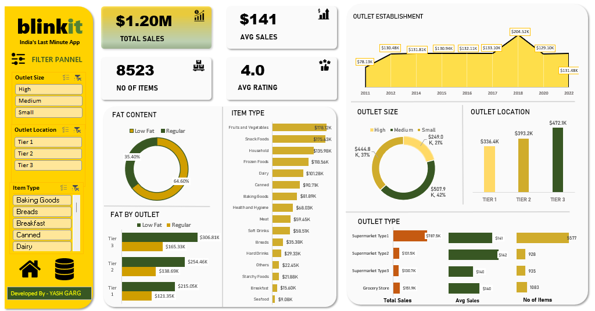

# Blinkit Sales Analysis Dashboard

> ### 📷 Dashboard Preview

  

---

## 📌 Project Overview

This project presents an interactive **Microsoft Power BI dashboard** analyzing Blinkit sales data. The dashboard provides insights into overall sales performance, outlet characteristics, item types, fat content, outlet locations, outlet sizes, and outlet establishment trends.

It enables users to explore the data interactively through **KPI Cards, Charts, and Slicers**.

---

## 🎯 Business Requirements

* Analyze overall Blinkit sales performance.
* Identify sales trends based on outlet establishment year.
* Compare sales across different outlet sizes.
* Analyze sales by outlet location tiers.
* Identify top-performing item categories.
* Compare Low Fat and Regular products.
* Analyze outlet types based on sales, average sales, and number of items.
* Provide an interactive dashboard for business analysis.

---

## 📊 KPI Metrics

* Total Sales
* Average Sales
* Number of Items
* Average Rating

---

## 📈 Dashboard Visuals

* Outlet Establishment Sales Trend
* Fat Content Analysis
* Fat Content by Outlet
* Item Type Sales Analysis
* Outlet Size Analysis
* Outlet Location Analysis
* Outlet Type Analysis
* Total Sales by Outlet Type
* Average Sales by Outlet Type
* Number of Items by Outlet Type

---

## 🧹 Data Cleaning & Transformation

The dataset was cleaned and transformed using **Power Query** before building the Power BI dashboard.

### Cleaning & Transformation Steps

* Removed unnecessary and duplicate records where applicable.
* Handled missing and inconsistent values.
* Standardized categorical fields.
* Transformed and formatted relevant columns.
* Created required calculated fields.
* Prepared the final dataset for analysis and visualization.
* Built relationships and structured the data for Power BI reporting.

---

## 📂 Data Source

The project uses a **Blinkit grocery sales dataset** containing information related to items, sales, outlet characteristics, ratings, fat content, item types, and outlet establishment details.

---

## 💡 Key Insights

* Total sales generated are approximately **$1.20M**.
* The dataset contains **8,523 items**.
* The average customer rating is **4.0**.
* The average sales value is approximately **$141**.
* **Regular-fat products** contribute a larger share of sales compared with Low-Fat products.
* **Tier 3 outlets** generate the highest sales among the three outlet location tiers.
* **Fruits & Vegetables** and **Snack Foods** are among the highest-performing item categories.
* Outlet sales vary significantly based on outlet type and establishment year.
* Supermarket outlets contribute significantly to overall sales performance.

---

## 📌 Conclusion

The Blinkit Sales Analysis Dashboard provides a comprehensive view of sales performance across different product and outlet dimensions.

The analysis helps identify high-performing item categories, outlet locations, outlet sizes, and outlet types while providing an interactive way to explore the business data. The dashboard demonstrates how **Power BI can be used to transform raw sales data into meaningful business insights and decision-support visualizations**.

---

## 🛠️ Tools & Technologies Used

### Tools

* Microsoft Power BI
* Power Query
* DAX

### Power BI Features

* KPI Cards
* Slicers
* Donut Charts
* Bar Charts
* Area Chart
* Data Labels
* Interactive Dashboard Design
* Data Transformation
* DAX Measures

---

## 👨‍💻 By Yash Garg
